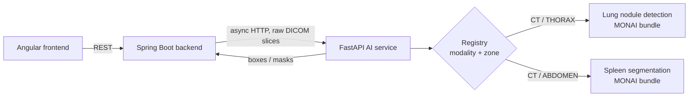

# 🧠 Medical Imaging AI Service

> AI inference microservice of the **AI-Powered Medical Imaging Analysis & Automated Radiology Reporting Platform** — built during my AI Engineering internship at **XeleronAI Ltd** (London, remote).


Backend: [medical-imaging-backend](https://github.com/ahmedaminefaiz/medical-imaging-backend) · Frontend: [medical-imaging-frontend](https://github.com/ahmedaminefaiz/medical-imaging-frontend)

---

## ✨ Features

- 🫁 **Lung nodule detection** on chest CT — MONAI bundle `lung_nodule_ct_detection` (RetinaNet 3D), returns bounding boxes per slice
- 🩸 **Spleen segmentation** on abdominal CT — MONAI bundle `spleen_ct_segmentation` (3D U-Net), returns one PNG mask per slice
- 🗂️ **Model registry** keyed by `(modality, body zone)` — the right model is picked automatically, lazily loaded on first call, then cached in memory (thread-safe)
- 📥 Takes the **raw DICOM series** (one multipart part per slice), sorts slices by z-position and rebuilds the 3D volume (axial slices only)
- 🎚️ Configurable **confidence threshold** (global or per request)
- 🔒 **Stateless** — DICOM files only live in an ephemeral temp dir during inference, nothing is persisted; only called by the backend, never exposed to the browser
- 🧪 Tests with mocked models (no weights needed in CI)

## 🏗️ Architecture



The backend stores every result as `EN_ATTENTE` (pending): **the AI proposes, the clinician decides**.

```
app/
├── main.py          # FastAPI app
├── api/routes.py    # /health, /predict
├── registry.py      # (modality, zone) → MONAI bundle, lazy load + cache
├── inference.py     # DICOM → volume → detection / segmentation
├── schemas.py       # Pydantic responses
└── config.py        # settings (env vars)
```

## 🔌 API

| Method | Endpoint | Description |
|---|---|---|
| `GET` | `/health` | Liveness check |
| `POST` | `/predict?modalite=CT&zone=THORAX[&seuil=0.5]` | Lung nodule **detection** |
| `POST` | `/predict?modalite=CT&zone=ABDOMEN[&seuil=0.5]` | Spleen **segmentation** |

Body: `multipart/form-data`, field `files` repeated (one part per raw DICOM slice).
Errors: `422` unknown modality/zone or invalid series · `503` model bundle missing or failed to load.

**Detection**

```bash
curl -F "files=@slice1.dcm" -F "files=@slice2.dcm" \
  "http://localhost:8000/predict?modalite=CT&zone=THORAX"
```

```json
{
  "type": "BOX",
  "detections": [
    { "label": "nodule", "bbox": { "x": 210, "y": 148, "w": 18, "h": 17 }, "confiance": 0.87, "coupe": 64 }
  ]
}
```

`coupe` = 0-based slice index in the series sorted by z-position · `bbox` in slice pixels.

**Segmentation**

```bash
curl -F "files=@slice1.dcm" -F "files=@slice2.dcm" \
  "http://localhost:8000/predict?modalite=CT&zone=ABDOMEN"
```

```json
{
  "type": "MASQUE",
  "detections": [
    { "coupe": 42, "label": "rate", "confiance": 0.93, "masque_base64": "iVBORw0KG..." }
  ]
}
```

One entry per slice containing the spleen · no `bbox` · `masque_base64` = grayscale PNG (0/255) of the slice.

## 📦 Get the models (MONAI Model Zoo)

```bash
python -m monai.bundle download "lung_nodule_ct_detection" --bundle_dir ./models
python -m monai.bundle download "spleen_ct_segmentation" --bundle_dir ./models
```

Expected layout: `models/<bundle>/configs/inference.json` and `models/<bundle>/models/model.pt`.
Weights are **not** committed to the repo (`model.pt` ≈ 84 MB).

## ▶️ Run locally

**Prerequisites:** Python 3.11

```bash
python -m venv .venv && source .venv/bin/activate   # Windows: .venv\Scripts\activate
pip install -r requirements-dev.txt
cp .env.example .env

uvicorn app.main:app --reload --port 8000
```

Interactive docs: http://localhost:8000/docs

## 🐳 Docker

CPU-only PyTorch image; the models are mounted as a volume.

```bash
docker build -t medical-imaging-ai-service .
docker run -p 8000:8000 -v "$PWD/models:/models" medical-imaging-ai-service
```

## ⚙️ Configuration

| Variable | Default | Role |
|---|---|---|
| `CONFIDENCE_THRESHOLD` | `0.5` | Detections below this score are dropped |
| `MODELS_DIR` | `./models` (`/models` in Docker) | Root folder of the MONAI bundles |
| `INFER_PATCH_SIZE` | bundle (`[192,192,80]`) | Sliding-window patch for detection, e.g. `[128,128,64]` |
| `SEG_ROI_SIZE` | bundle (`[96,96,96]`) | Sliding-window ROI for segmentation (lower it on small GPUs) |

## 📊 Performance (measured)

| Task | Hardware | Series | Model load | Inference | Memory |
|---|---|---|---|---|---|
| Lung nodule detection | CPU | NLST, 150 × 512² | ~10 s | ~10 min (patch `[128,128,64]`) | default patch needs ~3 GB RAM |
| Spleen segmentation | GPU | Abdominal CT, 33 × 512² | ~3 s | ~18 s | ~770 MB VRAM peak |

- On CPU, detection with the default patch fails on machines with < 3 GB free RAM → set `INFER_PATCH_SIZE=[128,128,64]`.
- ~10 min per series is **too slow for synchronous use**, which is why the backend calls this service **asynchronously**. A GPU is recommended in production.
- Segmentation was validated on the Medical Segmentation Decathlon (Task09_Spleen, converted to a DICOM series): the mask lands on soft-tissue HU values at the expected spleen location.

## 🧪 Tests

```bash
pytest
```

The real models are mocked, so tests run without downloading the weights.

## 🗺️ Roadmap

- [x] Lung nodule detection (CT thorax)
- [x] Spleen segmentation (CT abdomen)
- [x] Docker image
- [ ] GPU image & batch inference
- [ ] More modalities / body zones (X-ray, MRI)
- [ ] Inputs for automated radiology report generation

---

> ⚠️ Research / educational project — not a certified medical device. Results must always be reviewed by a qualified clinician.

👤 **Ahmed Amine Faiz** — AI Engineering student @ ENIAD Berkane · [GitHub](https://github.com/ahmedaminefaiz)
