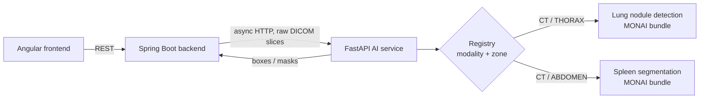

# 🧠 Medical Imaging AI Service

> AI inference microservice of the **AI-Powered Medical Imaging Analysis & Automated Radiology Reporting Platform** — built during my AI Engineering internship at **XeleronAI Ltd** (London, remote).


Backend: [medical-imaging-backend](https://github.com/ahmedaminefaiz/medical-imaging-backend) · Frontend: [medical-imaging-frontend](https://github.com/ahmedaminefaiz/medical-imaging-frontend)

---

## ✨ Features

- 🫁 **Lung nodule detection** on chest CT — MONAI bundle `lung_nodule_ct_detection` (RetinaNet 3D), returns bounding boxes per slice
- 🩸 **Spleen segmentation** on abdominal CT — MONAI bundle `spleen_ct_segmentation` (3D U-Net), returns one PNG mask per slice
- 🗂️ **Model registry** keyed by `(modality, body zone)` — the right model is picked automatically, lazily loaded on first call, then cached in memory (thread-safe)
- 📥 Takes the **raw DICOM series** (one multipart part per slice), sorts slices by z-position and rebuilds the 3D volume (axial slices only)
- 🎚️ Configurable **confidence threshold** for detection (global or per request)
- 🔒 **Stateless** — DICOM files only live in an ephemeral temp dir during inference, nothing is persisted; no access to MinIO or the database — it only receives the DICOM bytes sent by the backend, and is never exposed to the browser
- 🧪 Tests with mocked models (no weights needed in CI)

## 🏗️ Architecture



The backend stores every result as `EN_ATTENTE` (pending): **the AI proposes, the clinician decides**.

```
app/
├── main.py          # FastAPI app
├── api/routes.py    # /health, /predict
├── registry.py      # (modality, zone) → MONAI bundle, lazy load + cache
├── inference.py     # DICOM → volume → detection / segmentation
├── schemas.py       # Pydantic responses
└── config.py        # settings (env vars)
```

**Inference pipeline** — one shared trunk, then a post-processing step per model type:

1. `registry.get_model(modalite, zone)` → model + type (`detection` / `segmentation`), loaded on first use and cached
2. `inference.run_inference` → `read_series` sorts the slices by z-position, writes them to an ephemeral temp dir for MONAI's ITK reader, then:
   - **detection** → `infer_volume` + `raw_to_detections` (confidence threshold, boxes mapped to slice pixels) → response `type: "BOX"`
   - **segmentation** → `infer_segmentation` (bundle preprocessing, sliding-window inferer, the bundle's `Activationsd` + `Invertd` to go back to the original DICOM geometry, argmax, one PNG per slice) → response `type: "MASQUE"`

### 🧩 Extensibility

Adding a model = **one entry in `MODEL_SPECS`** (`registry.py`) + its MONAI bundle in `models/`. Routing, DICOM reading, caching, the API and the backend contract don't change. Segmentation was added exactly this way (a `("CT", "ABDOMEN")` entry + a segmentation loader and post-processing), and detection kept working unchanged. A brand-new model *type* additionally needs its own loader and post-processing function.

## 🔌 API

| Method | Endpoint | Description |
|---|---|---|
| `GET` | `/health` | Liveness check |
| `POST` | `/predict?modalite=CT&zone=THORAX[&seuil=0.5]` | Lung nodule **detection** |
| `POST` | `/predict?modalite=CT&zone=ABDOMEN[&seuil=0.5]` | Spleen **segmentation** |

Body: `multipart/form-data`, field `files` repeated (one part per raw DICOM slice).
Errors: `422` unknown modality/zone or invalid series · `503` model bundle missing or failed to load.

**Detection**

```bash
curl -F "files=@slice1.dcm" -F "files=@slice2.dcm" \
  "http://localhost:8000/predict?modalite=CT&zone=THORAX"
```

```json
{
  "type": "BOX",
  "detections": [
    { "label": "nodule", "bbox": { "x": 210, "y": 148, "w": 18, "h": 17 }, "confiance": 0.87, "coupe": 64 }
  ]
}
```

`coupe` = 0-based slice index in the series sorted by z-position · `bbox` in slice pixels.

**Segmentation**

```bash
curl -F "files=@slice1.dcm" -F "files=@slice2.dcm" \
  "http://localhost:8000/predict?modalite=CT&zone=ABDOMEN"
```

```json
{
  "type": "MASQUE",
  "detections": [
    { "coupe": 42, "label": "rate", "confiance": 0.93, "masque_base64": "iVBORw0KG..." }
  ]
}
```

One entry per slice containing the spleen · no `bbox` · `masque_base64` = grayscale PNG (0/255) of the slice.

## 🚀 Setup

**Prerequisites:** Python 3.11

```bash
# 1. Environment
python -m venv .venv && source .venv/bin/activate   # Windows: .venv\Scripts\activate
pip install -r requirements-dev.txt
cp .env.example .env

# 2. Download the MONAI bundles (Model Zoo) into ./models
python -m monai.bundle download "lung_nodule_ct_detection" --bundle_dir ./models
python -m monai.bundle download "spleen_ct_segmentation" --bundle_dir ./models

# 3. Run the service
uvicorn app.main:app --reload --port 8000     # docs: http://localhost:8000/docs

# 4. Run the tests (models are mocked, no weights needed)
pytest
```

Expected layout: `models/<bundle>/configs/inference.json` and `models/<bundle>/models/model.pt` — a missing file returns **503** on `/predict`.
`models/` is **gitignored**: the weights are not versioned (`model.pt` ≈ 84 MB) and must be downloaded on each machine. The folder can be changed with `MODELS_DIR`.

## 🐳 Docker

CPU-only PyTorch image; the models are mounted as a volume.

```bash
docker build -t medical-imaging-ai-service .
docker run -p 8000:8000 -v "$PWD/models:/models" medical-imaging-ai-service
```

## ⚙️ Configuration

Environment variables (or `.env`), read by `app/config.py`:

| Variable | Default | Role |
|---|---|---|
| `CONFIDENCE_THRESHOLD` | `0.5` | **Detection only**: boxes below this score are dropped. Overridable per request with `?seuil=`. Not applied to segmentation (its `confiance` is the mean spleen probability over the mask). |
| `MODELS_DIR` | `./models` (`/models` in Docker) | Root folder of the MONAI bundles |
| `INFER_PATCH_SIZE` | unset → bundle value (`infer_patch_size` in the bundle's `inference.json`) | Sliding-window patch for **detection**, e.g. `[128,128,64]` |
| `SEG_ROI_SIZE` | unset → bundle value (`[96,96,96]`) | Sliding-window ROI for **segmentation** |

> **Memory is a hardware constraint, not a model limit.** The patch / ROI size sets how much RAM or VRAM one sliding-window step needs. On a CPU with little free RAM or a small GPU (e.g. 2 GB VRAM), the bundle defaults can run out of memory (OOM): lower `INFER_PATCH_SIZE` and/or `SEG_ROI_SIZE`. The model and weights stay the same; smaller patches mean more windows, so inference is slower.

## 📊 Performance (measured)

Latency per series, **compared on the same hardware**:

| Hardware | Detection (lung nodules, CT thorax) | Segmentation (spleen, CT abdomen) |
|---|---|---|
| **GPU NVIDIA T4** (Colab-type) | ~13–15 s | ~1–3 s |
| Small local GPU (2 GB VRAM, reduced patch) | ~4–5 min | — *(not measured)* |
| CPU | ~10 min (`INFER_PATCH_SIZE=[128,128,64]`) | — *(not measured)* |

- **Latency depends heavily on the GPU.** On the same hardware (T4), segmentation is about 5–10× faster than detection.
- On CPU, detection with the bundle's default patch needs ~3 GB of RAM → set `INFER_PATCH_SIZE=[128,128,64]` on smaller machines.
- Several minutes per series on CPU / small GPU is **too slow for synchronous use**, which is why the backend calls this service **asynchronously**. A GPU is recommended in production.
- Segmentation was validated on the Medical Segmentation Decathlon (Task09_Spleen, converted to a DICOM series): the mask lands on soft-tissue HU values at the expected spleen location.

## 🧪 Tests

`pytest` — the real models are replaced by fakes (patched `registry.get_model`, fake bundle preprocessing / post-processing), so tests run without the weights.

## 🗺️ Roadmap

- [x] Lung nodule detection (CT thorax)
- [x] Spleen segmentation (CT abdomen)
- [x] Docker image
- [ ] GPU image & batch inference
- [ ] More modalities / body zones (X-ray, MRI)
- [ ] Inputs for automated radiology report generation

---

> ⚠️ Research / educational project — not a certified medical device. Results must always be reviewed by a qualified clinician.

👤 **Ahmed Amine Faiz** — AI Engineering student @ ENIAD Berkane · [GitHub](https://github.com/ahmedaminefaiz)
